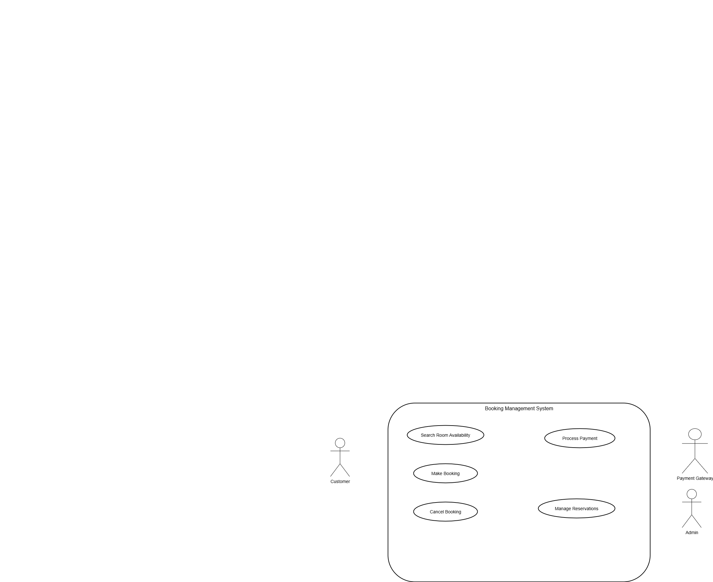

# Requirement Analysis in Software Development

This repository is dedicated to understanding and documenting the process of **requirement analysis** in software development.  

Requirement analysis is a critical first step in building successful software systems. It involves identifying, gathering, and analyzing the needs of stakeholders to ensure that the final product meets user expectations and business goals.  

The purpose of this repository is to:
- Provide examples of requirement analysis techniques and documents.
- Serve as a learning resource for students, developers, and project managers.
- Demonstrate how proper requirement analysis contributes to reducing project risks and improving software quality.

---

## What is Requirement Analysis?

Requirement Analysis is the process of **identifying, documenting, and managing the needs and expectations of stakeholders** for a software system. It serves as the foundation for the entire Software Development Life Cycle (SDLC) because it defines *what* the system should do before developers decide *how* to build it.

### Key Aspects of Requirement Analysis:
1. **Gathering Requirements** – Collecting information from stakeholders, users, and business teams through interviews, surveys, workshops, and observations.  
2. **Analyzing Requirements** – Evaluating and refining the gathered information to remove ambiguity, resolve conflicts, and prioritize features.  
3. **Documenting Requirements** – Writing clear and structured requirement specifications such as Software Requirement Specifications (SRS), user stories, or use cases.  
4. **Validating Requirements** – Ensuring the documented requirements truly represent stakeholder needs and are technically feasible.  

### Importance in the SDLC:
- **Clarity of Scope:** Defines the project’s boundaries, avoiding scope creep.  
- **Improved Communication:** Creates a common understanding between stakeholders, developers, and testers.  
- **Reduced Risks:** Identifies potential issues early, minimizing costly changes later in development.  
- **Quality Assurance:** Serves as the basis for test cases, ensuring the final product meets user expectations.  
- **Cost and Time Efficiency:** A well-defined requirement analysis process prevents unnecessary rework and delays.  

---

## Why is Requirement Analysis Important?

Requirement Analysis is critical in the SDLC because:

1. **Prevents Misunderstandings**  
   Clearly documents stakeholder needs to ensure developers and clients are aligned.  

2. **Minimizes Project Risks**  
   Helps identify potential problems early in the development process, reducing costly fixes later.  

3. **Improves Software Quality**  
   Provides a strong foundation for design, development, and testing, ensuring the final product meets expectations.  

---

## Key Activities in Requirement Analysis

The five major activities in requirement analysis include:

- **Requirement Gathering:** Collecting raw requirements from stakeholders through surveys, interviews, meetings, and observations.  
- **Requirement Elicitation:** Refining gathered requirements, removing ambiguities, and understanding stakeholder needs in detail.  
- **Requirement Documentation:** Writing clear and structured documents such as Software Requirements Specifications (SRS), user stories, and use cases.  
- **Requirement Analysis and Modeling:** Analyzing requirements to detect conflicts or redundancies, and creating models like data flow diagrams or use case diagrams.  
- **Requirement Validation:** Ensuring that requirements are feasible, testable, and aligned with business objectives.  

---

## Types of Requirements

### Functional Requirements
Functional requirements describe **what the system should do**. They define specific functionalities and features.

**Examples for Booking Management System:**
- Users should be able to search available rooms by date.  
- The system should allow users to book, cancel, or modify reservations.  
- Payment should be processed through multiple methods (credit card, PayPal, mobile money).  

### Non-functional Requirements
Non-functional requirements describe **how the system should perform**. They define system qualities and constraints.

**Examples for Booking Management System:**
- The system must handle up to 1,000 concurrent users without performance degradation.  
- Response time for booking confirmation should not exceed 3 seconds.  
- The system must comply with GDPR data privacy regulations.  
- The system should be available 99.9% of the time.  

---

## Use Case Diagrams

Use Case Diagrams visually represent how **actors (users or systems)** interact with a system to achieve goals. They help stakeholders quickly understand the system’s functionality without technical details.

**Benefits:**
- Simplifies communication between stakeholders and developers.  
- Highlights different user roles and system interactions.  
- Provides a foundation for writing user stories and test cases.  

### Example: Booking Management System

Actors:
- **Customer**
- **Admin**
- **Payment Gateway**

Use Cases:
- Search Room Availability  
- Make Booking  
- Cancel Booking  
- Process Payment  
- Manage Reservations  

---

## Acceptance Criteria

Acceptance Criteria are **predefined conditions that must be met for a feature to be accepted** as complete. They guide developers and testers, ensuring features meet stakeholder expectations.

### Importance:
- Provides clarity on feature scope.  
- Serves as the basis for testing.  
- Prevents misunderstandings between developers and stakeholders.  

### Example – Checkout Feature (Booking System):
- Users must be able to enter valid payment details.  
- The system must validate payment before confirming booking.  
- Booking confirmation should be displayed within 3 seconds.  
- An email confirmation must be sent automatically to the user.  
